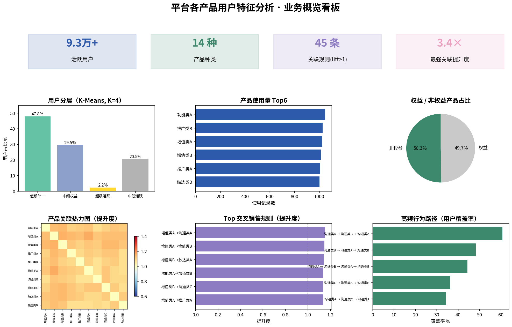

# 平台各产品用户特征分析

对招聘平台上使用不同产品的付费企业用户做的一次分析，想搞清楚三件事：

1. 用户能不能分层，方便针对不同群体做运营；
2. 哪些产品之间有关联，可以做交叉推荐；
3. 用户在平台里的典型使用路径是什么样的。

做法是 K-Means 聚类分群 + 关联规则（支持度/置信度/提升度）+ 行为路径挖掘。



> 上图为业务概览看板，汇总了用户分层、产品关联与行为路径的核心结果。

## 思路

```
取数 → 预处理 → 特征工程(RFM + 行为 + 属性) → K-Means 分群(肘部法则选 K)
     → 聚类画像 → 打标签 → 产品关联规则 → 分群产品偏好 → 路径挖掘
```

| 环节 | 方法 |
|---|---|
| 特征工程 | RFM + 使用强度 + 产品多样性 + 活跃度评分，按用户聚合 |
| 分群 | K-Means，肘部法则(二阶差分)自动定 K，PCA 降维看效果 |
| 关联 | 共现统计 + 支持度/置信度/提升度 |
| 标签 | 聚类标签 + 属性/城市/行业/薪资/活跃度规则标签 |
| 路径 | 时序序列子串频次统计，长度≥3 的高频路径 |

分析结论和图见 [`report/`](./report)。完整的分析过程（代码+图+结论串在一起）见 [`analysis.ipynb`](./analysis.ipynb)，GitHub 上可直接打开看。

## 目录

```
├── main.py                          # 主流程
├── requirements.txt
├── data/
│   └── sample_user_behavior.csv     # 测试数据（脚本生成）
├── src/
│   ├── data_loader.py               # 取数
│   ├── preprocessing.py             # 预处理 + 特征工程
│   ├── clustering.py                # K-Means + PCA
│   ├── labeling.py                  # 打标签 + 画像 + 导出
│   ├── association.py               # 关联规则
│   ├── path_analysis.py             # 路径挖掘
│   ├── generate_charts.py           # 画图
│   ├── dashboard.py                 # 业务概览看板（静态大图）
│   └── data/
│       └── generate_sample_data.py  # 生成测试数据
└── report/                          # 报告、图表、看板
```

> 生产环境用的是 Hive 表，这里放的是脚本生成的测试数据，方便直接把流程跑起来。产品名用了代号（沟通类/触达类/推广类/增值类/功能类），数字也换成了占比。

## 跑起来

```bash
pip install -r requirements.txt
python src/data/generate_sample_data.py   # 生成测试数据
python main.py                            # 跑分析
python src/generate_charts.py             # 画图
python src/dashboard.py                   # 生成业务概览看板（PNG）
```

生产环境换数据源：`export SOURCE_TABLE=表名` 或 `export ANALYTICS_DATA_PATH=xxx.csv`。

本地跑不用装 PySpark，默认读 `data/` 下的 csv，只有连生产 Hive 时才会用到 Spark。图里的中文需要机器装了中文字体才能正常显示。

## 用到的

Python · PySpark(取数) · pandas · numpy · scikit-learn(KMeans / PCA) · matplotlib · seaborn

## 说明

代码和报告仅用于展示分析思路和方法。出于数据安全和保密协议（NDA）要求，原始生产数据未包含在内，仓库里放的是脚本生成的测试数据；产品名做了代号化，涉及的业务数字用占比替代，不含任何未公开的商业信息。
