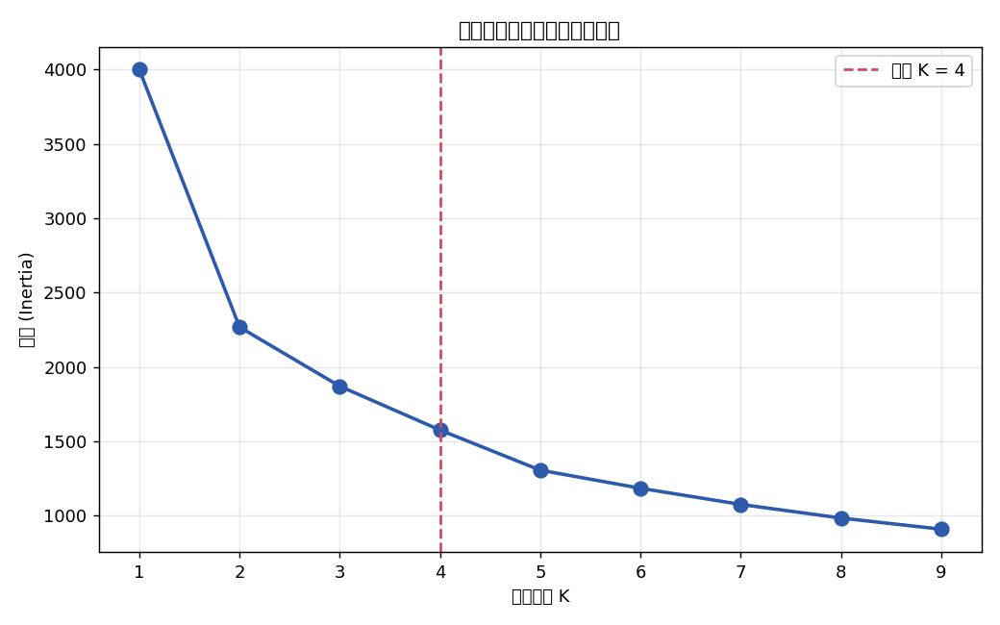
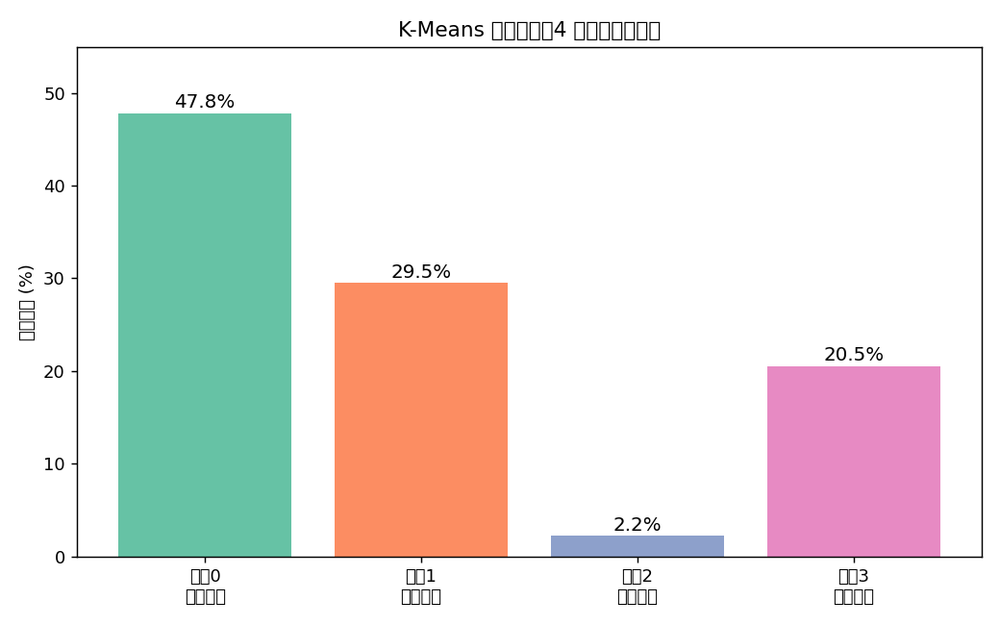
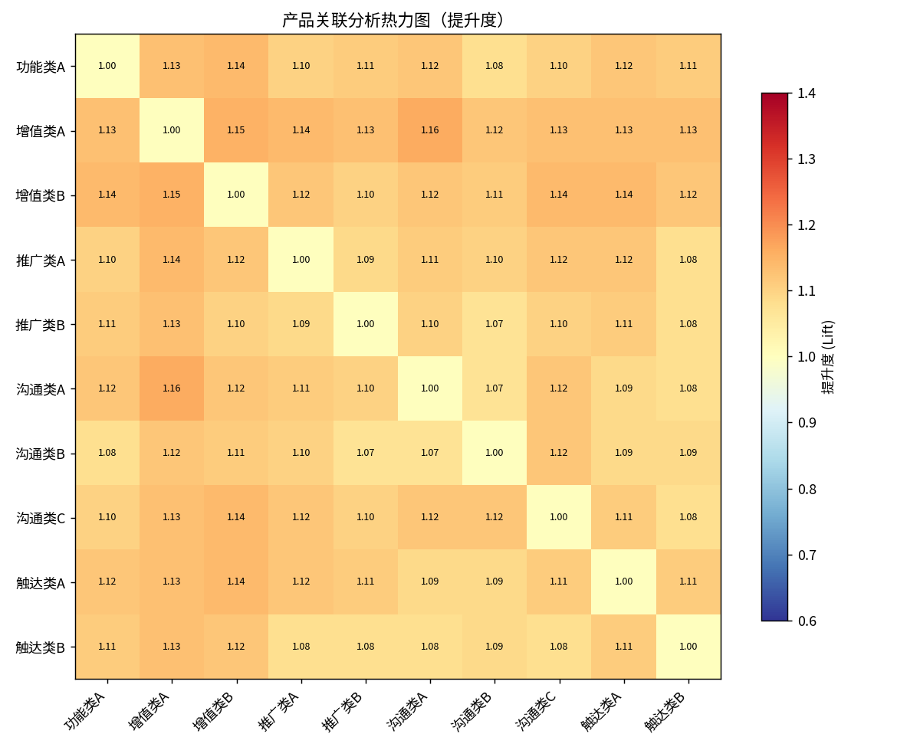
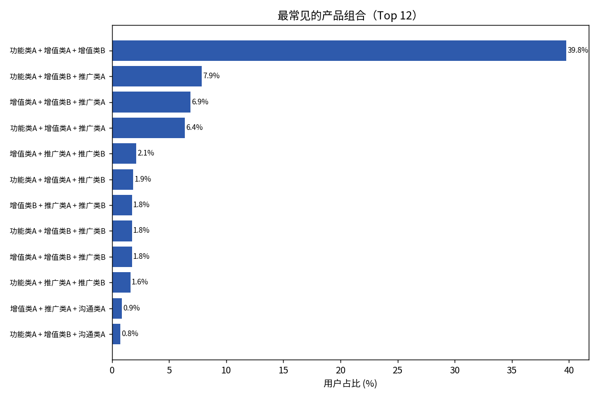
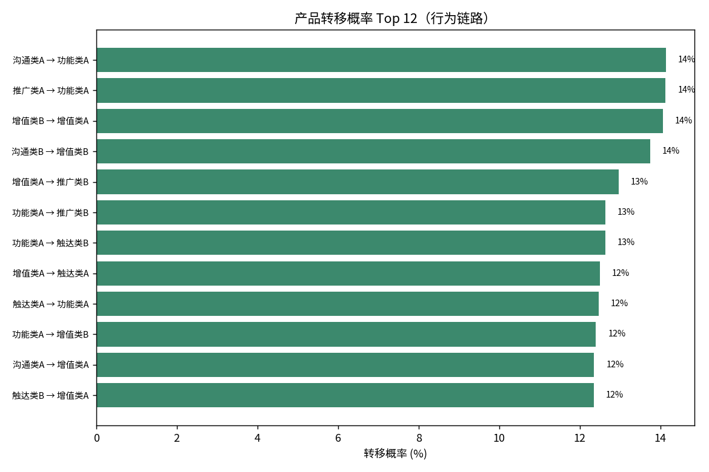

# 平台各产品用户特征分析

## 背景

平台有 14 类付费产品（含 5 类权益产品）。运营侧一直有个问题：发起某个产品时该圈哪类用户，以及该给用户推荐什么产品组合，基本靠经验，没有数据依据。

这次分析想把这件事量化一下，看能不能沉淀成规则，后续结合用户行为、特征和生命周期做产品推荐。

- 周期：约 3 个月（产品发起周期）
- 对象：期内用过平台产品的付费企业用户（近 10 万）
- 活跃口径：发起产品前 7 天内有搜索 / IM / 查看简历 / 新发职位行为

> 说明：产品名用了代号（沟通类/触达类/推广类/增值类/功能类），具体数字换成了占比。

## 一、用户分层

肘部法则确定 K=4，做 K-Means 聚类。

| 聚类 | 占比 | 特征 |
|---|---|---|
| 聚类 0 | 47.8% | 低频、单一产品 |
| 聚类 1 | 29.5% | 中频、偏权益产品 |
| 聚类 2 | 2.2% | 超级活跃、高频、多产品 |
| 聚类 3 | 20.5% | 中低活跃 |

聚类2 只占 2.2% 但价值密度最高，适合重点维系；聚类0 占了近一半，是低频群，需要激活。

## 二、产品关联

提升度 >1 的规则一共 45 条。按支持度、置信度、提升度分了几档：

| 分档 | 标准 | 占比 | 例子 |
|---|---|---|---|
| 主力 | 支持度>5% & 置信度30-60% & 提升度>1.5 | 8.9% | 触达类A→触达类B（1.88） |
| 精准 | 支持度1-5% & 提升度>2.0 | 6.7% | 推广类A→推广类B（3.38）、触达类B→增值类B（2.22） |
| 潜力 | 中支持中提升 | — | 可培育 |
| 基础/高置信 | 高覆盖低提升 / 高转化 | — | 兜底 |

提升度高的（比如推广类A→推广类B 到 3.38，即用了 A 的用户用 B 的概率是普通用户 3.4 倍）适合做捆绑或界面推荐；置信度高的（沟通类A→沟通类B 70%）适合做默认引导。

## 三、行为路径

从 7.6 万用户的序列（平均长度 18.1）里找长度≥3 的高频路径：

| 路径 | 用户覆盖率 |
|---|---|
| 沟通类A → 沟通类B → 沟通类A | 60.7% |
| 沟通类B → 沟通类A → 沟通类B | 48.3% |
| 沟通类A → 沟通类B → 沟通类A → 沟通类B | 44.4% |

转移概率也是一样，几乎所有产品的下一步都高概率转到沟通类A（比如沟通类C→沟通类A 88.8%）。

沟通类产品是整个平台的行为中枢。新产品的推荐时机放在用户"沟通"这个高频动作里，转化会更好。

## 四、建议

| 人群 | 时机 | 动作 | 依据 |
|---|---|---|---|
| 超级活跃群（聚类2） | 高频使用期 | 专属权益 + 续费提醒 | 一 |
| 中频权益群（聚类1） | 发起触达类A后 | 推触达类B（1.88） | 二 |
| 用过推广类A的 | 发起当下 | 推推广类B（3.38），做捆绑 | 二 |
| 全量 | 进入沟通链路时 | 嵌入产品推荐位 | 三 |
| 低频群（聚类0） | 沉默期 | 使用引导 + 互补产品召回 | 一 |

这些规则可以配进推荐引擎，结合实时行为触发。

## 方法

- 分层：RFM + 行为 + 属性特征，标准化后 K-Means，肘部法则（惯性二阶差分）定 K，PCA 看分布。
- 关联：共现 + 支持度/置信度/提升度，三个维度分档。
- 路径：行为按时间排成序列，算转移概率 + 统计长度≥3 子序列频次（按用户去重）。

代码见 [`src/`](../src)，45 条规则明细见 [`appendix_rules.md`](./appendix_rules.md)。
